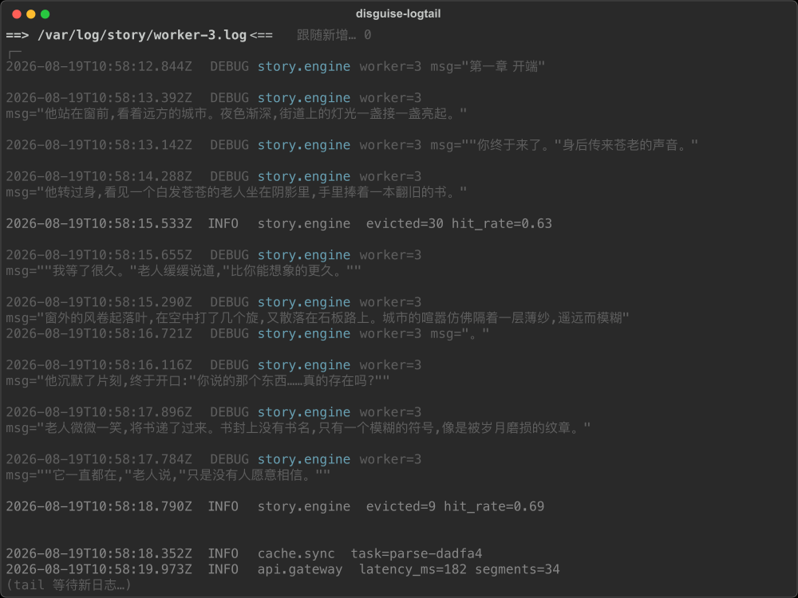
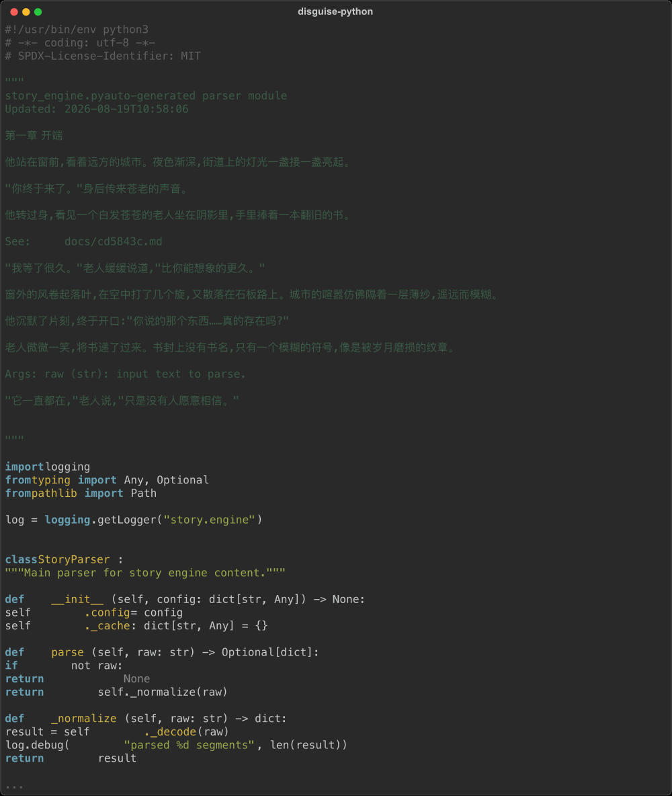
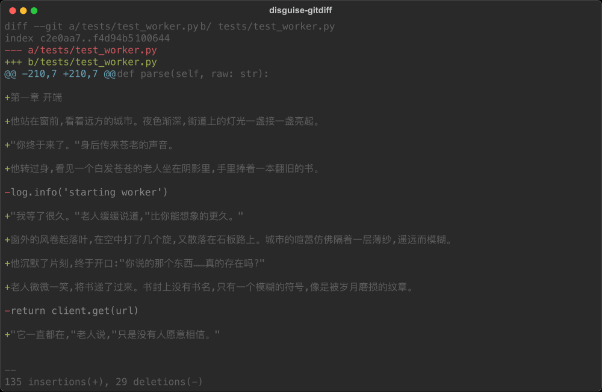
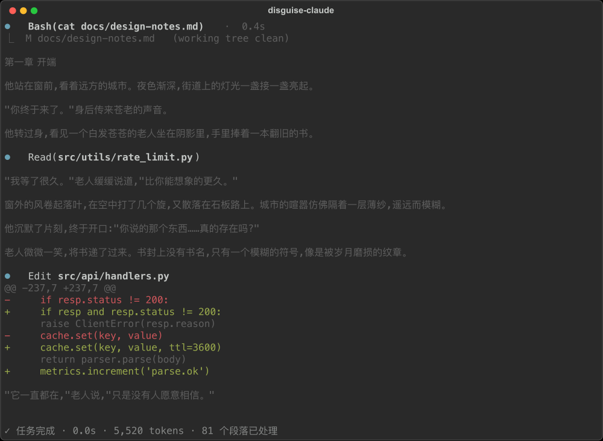
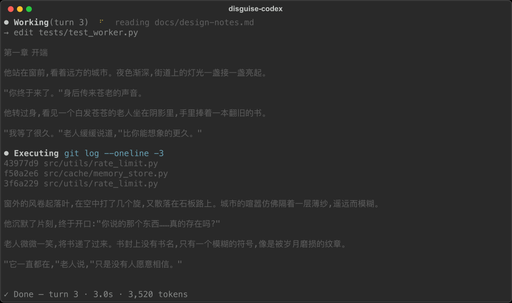
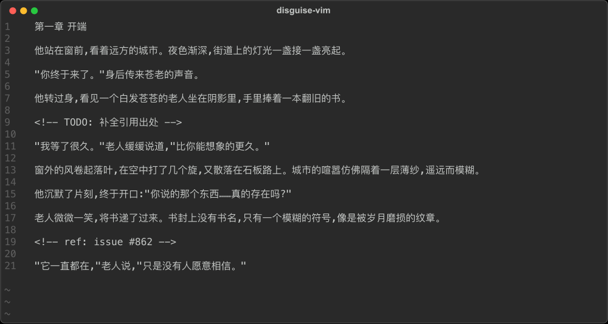
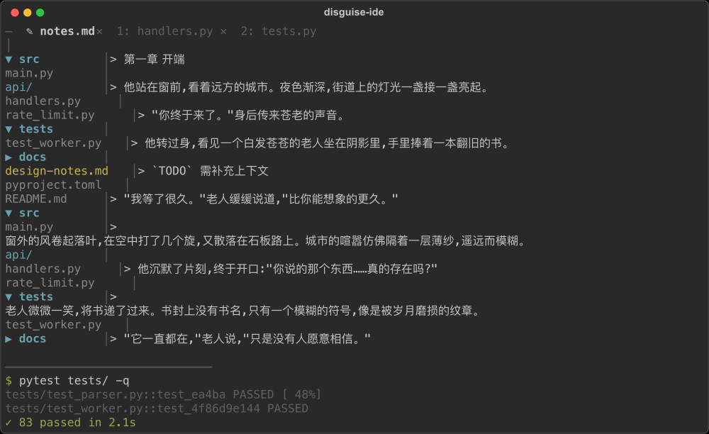

# 番茄小说 CLI 伪装阅读器

在终端里"边开发边读小说"——阅读界面伪装成开发会话(Claude Code / Codex /
Vim / IDE / 日志终端),同时通过番茄官方网页 API 与手机 App 双向同步阅读进度。

> 仅供个人学习与技术研究。内容版权归番茄小说及原作者所有。
> 本项目不提供、不存储任何小说内容,正文通过你自己的登录态获取。

## 完整章节正文(可选但推荐)

番茄网页对靠后章节只提供约 150 字试读。要读完整正文,
需本地跑一个 unidbg 签名服务(fqnovel-unidbg),它模拟 App 的
`libmetasec_ml.so` 签名库,以 App 身份请求官方内容 API。

### Docker 方式(推荐)

```bash
# 1. 构建镜像(需先本地编译出 JAR)
git clone https://github.com/mtongle/fqnovel-unidbg.git && cd fqnovel-unidbg
git lfs install && git lfs pull          # 拉取 SO 库
mvn clean package -DskipTests            # 编译(Java 17+ / Maven)
docker build -t fqnovel-unidbg:local .   # 打镜像

# 2. 启动(开机自启,失败自动重启)
./docker-run.sh start
```

### Java 直接运行

```bash
java -jar target/unidbg-boot-server-*.jar
```

服务监听 `http://127.0.0.1:8099`。阅读器会自动探测:
- 服务可用 → 读完整章节
- 服务不可用 → 回退网页试读(靠前章节仍是全文)

## 配置

启动后 `Ctrl+S` 打开设置页粘贴 Cookie,或直接写入
`~/.cli-novel-reader/cookie.txt`。可选环境变量:

```bash
CLI_NOVEL_DISGUISE=logtail     # logtail / python / gitdiff / claude / codex / vim / ide
UNIDBG_BASE="http://127.0.0.1:8099"   # unidbg 服务地址
```

## 伪装主题

伪装模式把正文包进一个"正在工作"的画面,而不是把小说当屏幕主角。
伪装时一次性渲染整章(可正常滚动阅读),不再流式输出。

### `logtail` — 伪生产日志(默认)

`DEBUG story.engine msg="..."` 暗色行,段间穿插彩色 INFO/WARN 活动日志。



### `python` — 伪 Python 源码

小说藏在模块 docstring(暗绿色),外面是彩色代码骨架(import/class/def)。
段落间穿插 docstring 内的附加说明行(Note/TODO/Args)。



### `gitdiff` — 伪 git diff

小说伪装成绿色 `+` added 行,红色 `-` removed 行做噪声,前后包 `@@ hunk header`。像在做 code review。



### `claude` — Claude Code 会话

tool call 卡片(Edit/Read/Bash) + 红绿 diff,小说是 `cat docs.md` 输出块里的暗色行。



### `codex` — OpenAI Codex CLI

Working spinner + turn 计数 + ctx 进度条,段落间穿插 pytest/git/npm 执行块。



### `vim` — 伪 Vim 编辑器

行号 gutter + `~` 空行 + `-- INSERT --`,段落间穿插 `<!-- TODO -->` 注释。



### `ide` — 伪 IDE

左侧彩色文件树 + `>` 引用块暗色预览 + 底部 pytest 终端面板。段间穿插 `> 引用` / `> TODO`。



### 主题对照表

| 主题 | 画面 | 小说伪装方式 | 段间噪声 |
|---|---|---|---|
| `logtail` | 伪生产日志(tail -f 结构化日志) | `DEBUG story.engine msg="..."` 暗色行 | INFO/WARN 活动日志 |
| `python` | 伪 Python 源码(import/class/def 彩色骨架) | 模块 docstring 暗绿色 | docstring 内 Note/TODO/Args |
| `gitdiff` | 伪 git diff(hunk header + 绿 + 行) | 绿色 `+` added 行 | 红色 `-` removed 行 |
| `claude` | Claude Code 会话(tool call / diff) | `cat docs.md` 输出块内暗色行 | ⏺ Edit/Read/Bash tool call |
| `codex` | OpenAI Codex CLI(Working / turn / ctx 进度) | 整理文档任务的暗色输出行 | ⏺ Executing pytest/git/npm |
| `vim` | 伪 Vim(行号 gutter / ~ 空行 / INSERT) | 正在编辑的 notes.md 正文 | `<!-- TODO -->` 注释 |
| `ide` | 伪 IDE(文件树 + md 预览 + 终端面板) | `>` 引用块样式的暗色预览 | `> 引用` / `> TODO` |

设计原则(参考 CloakingNote ACM 研究 + 同类项目 CodeNovel / tReader / CodeReader):

1. **小说行用显式低对比度色(rgb(130,130,130))**——CloakingNote 36 人研究验证:低对比度文字即使知道存在也不易被注意到,比 dim 更可靠(dim 在浅色终端失效)
2. **降低信噪比**:段落间穿插彩色工作噪声(git/pytest/docker/cargo/npm),让小说行淹没在噪声里,不再是视觉焦点
3. 伪装时自动隐藏 Textual 自带 Header/Footer,快捷键说明不会曝光
4. 顶栏、底栏都换成主题化文案(token 计数、`-- INSERT --`、branch 状态)
5. **静态渲染**:一次性渲染整章,可正常上下滚动阅读,不自动翻章

### 老板键(`f`)

按 `f` 快速流式输出**纯随机代码和构建日志**(import/def/pytest/git/docker/cargo/npm 等),
不含任何小说内容,60 行/秒一闪而过;再按 `f` 立即恢复原来的静态渲染和滚动位置,
阅读进度不受影响。未开启伪装时按 `f` 会自动先开启伪装再开始流式。

## 快捷键

| 键 | 功能 |
|---|---|
| `↓` / `j` | 向下滚一行 |
| `↑` / `k` | 向上滚一行 |
| `Space` / `PgDn` | 下翻一页 |
| `PgUp` | 上翻一页 |
| `n` / `p` | 下一章 / 上一章 |
| `d` | 切换伪装主题(logtail/python/vim/ide…) |
| `Shift+d` | 伪装 开 / 关 |
| `f` | **老板键**:快速流式输出纯代码/日志噪声(不含小说内容),再按恢复原位 |
| `c` | 章节目录 |
| `q` | 返回书架 |
| `Ctrl+S` | 打开设置 |
| `Ctrl+Q` | 退出 |

## 进度同步

打开书时从云端拉取进度自动续读;每读完一章上报云端,
手机 App 打开同一本书会跳到对应章节(章节级,不含章内页数)。